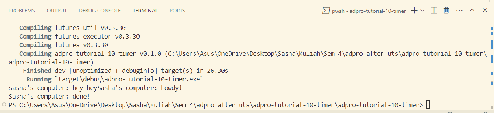
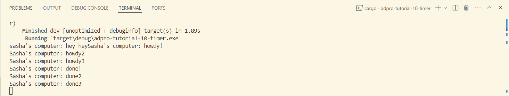

## 1.2. Understanding how it works

Berdasarkan hasil output dari program tersebut, dapat dilihat "hey hey" keluar sebagai output terlebih dahulu sebelum "howdy!" dan "done". Dalam hal ini, dapat dilihat bahwa fungsi async berjalan di luar fungsi yang menjalankannya dan dapat menjalankan perintah print("hey hey"); ketika async menunggu hasil dari future

## 1.3. Understanding how it works

Berdasarkan hasil output dari program tersebut, task yang ada akan semakin lebih banyak dijalankan karena adanya jumlah spawner yang banyak. Karena spawner tidak di-drop dengan menggunakan drop(spawner), maka program tidak akan pernah berhenti berjalan karena program masih memiliki asumsi bahwa pengiriman data oleh spawner masih perlu dijalankan. Task baru akan dijalankan kedalam task sender setelah spawner memanggil fungsi spawn, yang kemudian task tersebut akan diambil oleh executor untuk dieksekusi yang mana akan mengambil task hingga interaksi selesai setelah spawner di-drop.